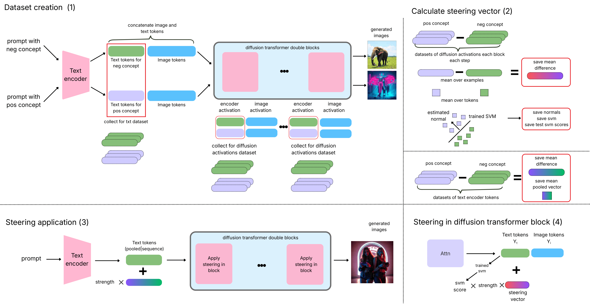

# [SHIFT: Steering Hidden Intermediates in Flow Transformers]()

**Nina Konovalova, Andrey Kuznetsov, Aibek Alanov**

<a href=""></a>
<a href=""></a>
<a href=""></a>
<a href=""></a>
[](./LICENSE.txt)

We propose SHIFT, a simple but effective and lightweight framework for concept removal in DiT diffusion models via targeted manipulation of intermediate activations at inference time, inspired by activation steering in large language models. SHIFT learns steering vectors that are dynamically applied to selected layers and timesteps to suppress unwanted visual concepts while preserving the prompt's remaining content and overall image quality. Beyond suppression, the same mechanism can shift generations into a desired style domain or bias samples toward adding or changing target objects.


## Nudity erase


## Environments

```bash
git clone <your-repo-url>
cd SHIFT
pip3 install -r requirements.txt
pip3 install clean-fid
pip3 install torchmetrics
```

## Quickstart



We provide an example workflow via scripts and a notebook-style pipeline (Colab link will be added).

### Step 1 — Extract activations and text embeddings

Edit `scripts/get_vector.sh` to set your concept, number of prompts, and paths, then run:

```bash
bash scripts/get_vector.sh
```

This runs two steps in sequence:
1. **`get_vector.py`** — generates images with the diffusion model and saves intermediate attention activations.
2. **`get_encoding_vector.py`** — encodes positive/negative concept prompts into text embeddings.

### Step 2 — Calculate steering vectors

Edit `scripts/steering_calculate.sh` to point to the `.pt` files produced in Step 1, then run:

```bash
bash scripts/steering_calculate.sh
```

Supports both activation-based vectors (SVM / mean-diff) and text-embedding-based vectors (`--method text`).

### Step 3 — Apply steering

Edit `scripts/remove_flux_schnell.sh` with your model, steering vector path, and prompts, then run:

```bash
bash scripts/remove_flux_schnell.sh
```

## Citation

If our work assists your research, feel free to cite:

```bibtex
@article{konovalova2025shift,
  title     = {SHIFT: Steering Hidden Intermediates in Flow Transformers},
  author    = {Konovalova, Nina and Kuznetsov, Andrey and Alanov, Aibek},
  year      = {2025}
}
```
